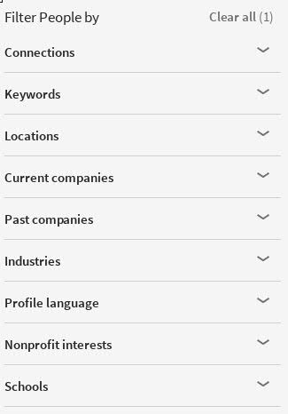

Linkedin Scrape
=======

This tool is aimed to scrape desired talent data on linkedin, include People name, title, location, and current or pass jobs, for example:

`
FirstName LastName
Sr Executive Warehouse and Logistics Operation. at Huawei telecommunication india pvt ltd.
Chennai Area, India
Current: Sr Executive Warehouse and Logistics Operation. at Huawei Telecommunications (India) co.Pvt Ltd.
`

## Usage

Supply key words and/or location to scrape

```bash
node index.js -s 'jobs keywords' -l 'France'

```


## Example Run

```bash
node index.js -s 'tivoli tws'
LinkedIn
58 results
Opening Page: 1
[ { current: 'Senior TWS L2 Support Engineer at IBM Tivoli Software',
    location: 'San Antonio, Texas Area',
    name: 'Pete Soto',
    title: 'Senior TWS L2 Software Engineer at HCL Technologies, IBM' },
  { current: 'Consultant SMPO TWS E2E Migration Specialist at IBM Tivoli Software',
    location: 'Baltimore, Maryland Area',
    name: 'Mark Neibuhr',
    title: 'Consultant SMPO TWS E2E Migration Specialist at IBM' },
  { current: 'TWS Specialist at IBM Argentina S.A.',
    location: 'Argentina',
    name: 'Marcos Barrionuevo',
    title: 'IT Specialist. TWS, Autosys and Control-M Senior Administrator. ' },
  { current: 'TWS L2 Back-up Team Lead at IBM Tivoli Software',
    location: 'Austin, Texas Area',
    name: 'LinkedIn Member',
    title: 'IBM Software Engineer' },
  { current: 'Past:\nSoftware Engineer at IBM',
    location: 'Austin, Texas Area',
    name: 'LinkedIn Member',
    title: 'Software Support Consultant at IBM Tivoli Software' },
  { current: 'Summary:\n...experience on IBM Tivoli... SKILLS: \n•\tIBM Tivoli...',
    location: 'Chennai Area, India',
    name: 'Mayank Chourasia',
    title: 'System Administrator at IBM Tivoli Software' },
  { current: 'Summary:\n...by IBM\'s Tivoli Software... Automation (SA);\n- Tivoli...',
    location: 'Austin, Texas Area',
    name: 'LinkedIn Member',
    title: 'Level 2 Technical Support at IBM Tivoli Software' },
  { current: 'Past:\nAdvisory Software Engineer at IBM',
    location: 'Austin, Texas Area',
    name: 'Clint Easterling',
    title: 'Technical Lead Software Engineer at Tivoli Systems' },
  { current: '',
    location: 'Greater Minneapolis-St. Paul Area',
    name: 'LinkedIn Member',
    title: 'at IBM Tivoli Software' },
  { current: '',
    location: 'Rome Area, Italy',
    name: 'Andrea Capasso',
    title: 'BigFix Endpoint Manager Consultant | IBM Security' } ]

```

## DEBUG

if come into problem, add debug flag before command:

```bash

DEBUG=horseman,horseman:v,linkedin node index.js 

```

## TODO

Support all other filter, currently only location fileter is supported

